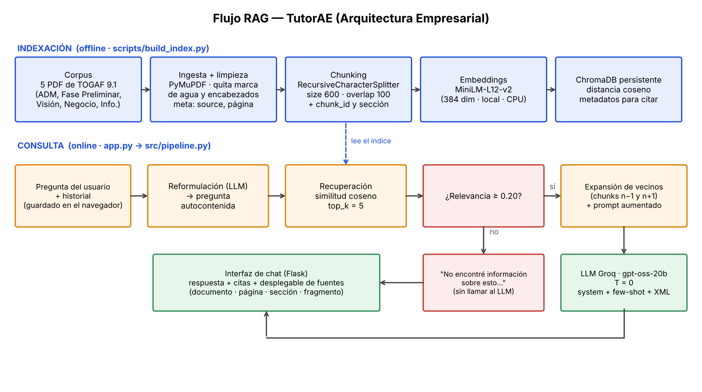

# TutorAE — Asistente RAG de Arquitectura Empresarial (TOGAF 9.1)

Asistente experto basado en **RAG** con memoria conversacional. Responde preguntas sobre el ADM de TOGAF 9.1
(Fase Preliminar, Visión de Arquitectura, Arquitectura de Negocio y de Información), **cita la fuente de cada
respuesta** (documento, página, sección y fragmento) y **se abstiene** cuando la información no está en la base de
conocimientos.

- **URL pública:** <https://tutor-ae.streamlit.app/>
- **Repositorio:** <https://github.com/MiguelAngelgcsp/Desarrollo-de-un-Asistente-Experto-basado-en-RAG-y-Agentes>
- **Integrantes:** Miguel Angel Correa Muñoz · Miguel Angel Gomez Cruz
- **Curso:** Desarrollo de Aplicaciones con IA — Fundación Universitaria Konrad Lorenz, Bogotá D.C., 2026-2 (Avance 2)

---

## 1. Dominio y corpus

Dominio: **tutor de Arquitectura Empresarial** para estudiantes de Ingeniería de Software II (Fundación
Universitaria Konrad Lorenz).

| Documento (`corpus/`) | Páginas | Fragmentos | Contenido |
|---|---|---|---|
| `TOGAF_9.1_Cap5_ADM.pdf` | 12 | 73 | Cap. 5: ciclo ADM, alcance e integración |
| `TOGAF_V9.1-FasePreliminar.pdf` | 12 | 54 | Fase Preliminar |
| `TOGAF_V9.1-VisionArquitectura.pdf` | 10 | 51 | Fase A: Visión de Arquitectura |
| `TOGAF_V9.1-ArquitecturaNegocio.pdf` | 14 | 74 | Fase B: Arquitectura de Negocio |
| `TOGAF_V9.1-ArquitecturaInformacion.pdf` | 12 | 51 | Fase C: Arquitecturas de Sistemas de Información |
| **Total** | **60** | **303** | |

Los cinco documentos cubren de forma secuencial el ADM, que es el contenido que el estudiante debe dominar.
Al ser un corpus coherente y acotado, se pueden formular preguntas "cercanas" fuera del corpus (Fase G, TOGAF 10,
Scrum…) para medir si el sistema se abstiene en lugar de inventar.

## 2. Flujo RAG implementado



| Etapa | Archivo | Decisión | Justificación |
|---|---|---|---|
| Ingesta | `src/document_loader.py` | PDF (PyMuPDF), DOCX, TXT, HTML; limpieza de marcas de agua y encabezados | PyMuPDF conserva mejor espacios y orden de lectura; quitar texto repetido evita que domine la similitud |
| Chunking | `src/splitter.py` | `RecursiveCharacterTextSplitter`, **600 caracteres, solape 100**, cortes `\n\n` → `\n` → `. ` → ` ` | Un fragmento por idea, con definiciones completas; el solape evita perder frases en el borde |
| Metadatos | `src/splitter.py` | `source`, `pagina`, `seccion` (Sec. 5.x), `chunk_id` | Permiten citar y localizar los fragmentos vecinos |
| Vectorización | `src/embeddings.py` | `paraphrase-multilingual-MiniLM-L12-v2` (384 dim, normalizado) | Multilingüe (preguntas en español, TOGAF en inglés), liviano, local en CPU, sin API |
| Índice | `src/vectorstore.py` | ChromaDB persistente (`chroma/<tag>`), distancia coseno | Persistencia y una carpeta por configuración experimental |
| Recuperación | `src/pipeline.py` | Similitud coseno, **top_k = 5**, **umbral de relevancia 0.20** | k pequeño reduce ruido; el umbral corta antes del LLM si nada es relevante |
| Expansión de vecinos | `src/pipeline.py` | Se agregan los fragmentos n−1 y n+1 de cada resultado | Las listas de TOGAF (objetivos, entradas, entregables) quedan repartidas en varios fragmentos; los vecinos aportan el contexto contiguo (mitiga el problema, pero no garantiza listas completas: ver §8) |
| Reformulación | `src/pipeline.py` | El LLM reescribe la pregunta de seguimiento como autocontenida | "¿Y qué entradas necesita esa fase?" no sirve como consulta vectorial; reformulada sí |
| Generación | `src/prompts.py`, `src/llm.py` | Groq (`GROQ_MODEL`, por defecto `openai/gpt-oss-20b`; despliegue y evaluación final: `openai/gpt-oss-120b`), temperatura 0 | Respuestas deterministas y trazables |

> Usa el **mismo modelo** (`GROQ_MODEL`) en la evaluación Ragas, el despliegue y el informe.

### Prompt (refinamiento del Avance 1) — `src/prompts.py`

- **System Prompt:** rol (TutorAE), objetivo, 9 reglas y formato de salida.
- **Delimitadores XML:** `<contexto><fragmento id fuente pagina seccion>`, `<historial>`, `<pregunta>`; lo que está dentro es dato, no instrucción.
- **Few-Shot:** 3 ejemplos (respuesta con cita, pregunta de seguimiento, caso fuera del contexto).
- **Formato de salida:** respuesta directa + viñetas si hay varios elementos + cita `(Fuente: archivo, Pág. n)`.

### Control de alucinaciones (dos capas)

1. **Umbral de relevancia:** si ningún fragmento lo supera, responde *"No encontré información sobre esto en la base de conocimientos."* sin llamar al LLM.
2. **Regla del System Prompt:** si hay fragmentos pero no contienen la respuesta, el LLM debe emitir exactamente esa frase; la interfaz no muestra fuentes.

## 3. Estructura

```
chat_bot_AE/
├── streamlit_app.py          # Interfaz desplegada (Streamlit Community Cloud)
├── app.py                    # Interfaz alternativa local (Flask)
├── requirements.txt          # runtime (torch CPU, langchain, chroma, streamlit…)
├── requirements-eval.txt     # + Ragas, pandas, matplotlib
├── .env.example              # plantilla de variables (la key real NO se sube)
├── .streamlit/secrets.toml.example
├── Dockerfile                # alternativa de despliegue en plataformas con Docker
├── corpus/                   # documentos a vectorizar (5 PDF de TOGAF)
├── src/                      # config, document_loader, splitter, embeddings, vectorstore, prompts, llm, pipeline
├── scripts/                  # build_index.py, chat_cli.py
├── eval/
│   ├── preguntas_eval.json   # 21 preguntas con ground truth (5 fuera del corpus)
│   ├── run_ragas.py          # evaluación (Ragas + hit-rate + abstención)
│   ├── calibrar_umbral.py    # ayuda para elegir MIN_RELEVANCE
│   ├── comparar.py           # tabla + gráfico antes/después
│   └── resultados/           # salidas de cada evaluación
├── docs/                     # diagrama, generar_diagrama.py, texto del informe
└── templates/ static/        # interfaz Flask
```

## 4. Instalación y ejecución local

Requisitos: **Python 3.11 o 3.12** (3.14 aún no tiene wheels para varias librerías) y una API key gratuita de [Groq](https://console.groq.com).

```bash
python -m venv .venv
# Windows:  .venv\Scripts\activate        macOS/Linux:  source .venv/bin/activate
pip install -r requirements.txt

cp .env.example .env        # Windows: copy .env.example .env   → pega tu GROQ_API_KEY en .env

python -m scripts.build_index     # (opcional) crea el índice; la app lo crea sola si no existe
streamlit run streamlit_app.py    # abre http://localhost:8501
# alternativas:  python app.py (Flask, http://localhost:5000)  ·  python -m scripts.chat_cli (consola)
```

La primera ejecución descarga el modelo de embeddings (~470 MB).

## 5. Evaluación con Ragas

Conjunto: `eval/preguntas_eval.json` — **21 preguntas**: 16 dentro del corpus (con *ground truth* y página esperada)
y 5 fuera del corpus (2 sin relación alguna y 3 "cercanas" al dominio).

### Instalación (Python 3.12, entorno aparte)

```powershell
py -3.12 -m venv env_ragas
.\env_ragas\Scripts\Activate.ps1
pip install -r requirements-eval.txt
pip check
```

En `.env` se requieren `GROQ_API_KEY` (genera las respuestas del RAG) y `GOOGLE_API_KEY` (juez de Ragas con Gemini). Se usa Google como juez porque Groq limita los modelos `gpt-oss` a 200.000 tokens diarios y la evaluación completa agota ese cupo.

### Ejecución

```powershell
python -m eval.calibrar_umbral                                                      # opcional: revisar MIN_RELEVANCE
python -m eval.run_ragas --tag base --workers 1 --judge-provider gemini             # línea base
python -m eval.run_ragas --tag base --reusar-respuestas --workers 1 --judge-provider gemini   # repetir solo Ragas
python -m eval.run_ragas --tag <iteracion> --<parametro> <valor> --workers 1 --judge-provider gemini
python -m eval.comparar base <iteracion>
```

Métricas (16 preguntas dentro del corpus; juez = LLM de Groq): **faithfulness, answer_relevancy, context_precision,
context_recall**. Además, sin costo de LLM: **hit-rate de recuperación**, **abstención correcta fuera del corpus**
(control de alucinaciones) y **abstención incorrecta dentro del corpus**; ayudan a atribuir el problema a
chunking, recuperación o generación.

### Si algo falla

| Error | Solución |
|---|---|
| `No module named 'langchain_community.chat_models.vertexai'` | Parchear `env_ragas\Lib\site-packages\ragas\llms\base.py` (línea ~12): envolver el import de `ChatVertexAI` en `try/except ImportError` y asignar `ChatVertexAI = None` si falla. Se pierde al reinstalar `ragas` |
| `cannot import name 'ModelProfile'` | Paquetes `langchain-*` desalineados: `pip install -U langchain-core langchain-huggingface langchain-groq langchain-google-genai` y `pip check` |
| `429 ... tokens per day` (Groq) | Cuota diaria agotada. Esperar el reinicio y usar `--reusar-respuestas --workers 1` |
| `Falta GOOGLE_API_KEY` | Crearla en https://aistudio.google.com/apikey y agregarla al `.env` |
| Valores `NaN` en `ragas_nan` | Límite del juez. Repetir con `--reusar-respuestas --workers 1` antes de reportar |

### Juez de Ragas (proveedor y modelo)

Por defecto el juez es un modelo de Groq (`llama-3.3-70b-versatile`). Se puede cambiar sin tocar el código:

```bash
python -m eval.run_ragas --tag base --judge-model llama-3.1-8b-instant             # otro modelo de Groq
python -m eval.run_ragas --tag base --judge-provider gemini                       # Gemini (requiere GOOGLE_API_KEY en .env)
python -m eval.run_ragas --tag base --judge-provider ollama --judge-model qwen2.5:7b-instruct   # modelo local con Ollama
```

Para Gemini: `pip install langchain-google-genai`; para Ollama: instalar Ollama y `pip install langchain-ollama`.
El juez usado queda registrado en `eval/resultados/<tag>_resumen.json` (campo `juez_ragas`). **Usa el mismo juez en la
línea base y en la iteración**, o la comparación no es válida.

Si el proveedor devuelve 429 (límite de tokens, frecuente en Groq gratuito porque Ragas hace varias llamadas por
pregunta), las métricas quedan vacías (NaN) en vez de detener la corrida: baja `--workers` a 1, prueba con `--limit 3`
o reparte la evaluación en varios días.

### Iteración de mejora (cambia UN parámetro y compara)

```bash
python -m eval.run_ragas --tag k10 --top-k 10                                 # ejemplo: top_k 5 → 10
python -m eval.run_ragas --tag chunk450 --chunk-size 450 --chunk-overlap 80   # ejemplo: chunking
python -m eval.comparar base k10                                              # tabla + gráfico en eval/resultados/
```

Guía de lectura: *context_precision* baja → ruido recuperado (bajar `top_k`, subir umbral); *context_recall* baja →
no se recupera lo necesario (subir `top_k`, cambiar chunking); *faithfulness* baja → el LLM agrega datos que no
están en el contexto (endurecer el prompt); *answer_relevancy* baja → respuestas largas o fuera de foco.

Nota: el modelo de embeddings procesa ~128 tokens; 600 caracteres equivalen a ~130–150 tokens, así que está en el
límite. Si el hit-rate es bajo, probar `--chunk-size 450` es una iteración natural.

Si Groq devuelve 429 (límite), usa `--workers 1` y `--reusar-respuestas`.

### Resultados

**Línea base (`--tag base`).** Valores por defecto de `src/config.py`: chunk_size 600, overlap 100, top_k 5,
umbral de relevancia 0.20, embeddings `paraphrase-multilingual-MiniLM-L12-v2`, LLM `openai/gpt-oss-120b` (Groq).
El conjunto completo (`eval/preguntas_eval.json`) tiene 21 preguntas (16 dentro del corpus y 5 fuera); la línea base
reportada en el informe de entrega se calculó sobre 16 preguntas (11 dentro del corpus y 5 fuera). Las cuatro métricas
de Ragas se calculan sobre las preguntas que sí están en el corpus.

| Métrica | Línea base | Qué mide |
|---|---|---|
| Faithfulness | 0.689 | La respuesta se apoya en los fragmentos recuperados |
| Answer relevancy | 0.563 | La respuesta contesta lo preguntado |
| Context precision | 0.178 | Los fragmentos recuperados son útiles y están bien ordenados |
| Context recall | 0.500 | Los fragmentos contienen la información de la referencia |

**Interpretación.**
- La métrica más baja es **context precision (0.178)**: según la guía de lectura de arriba, apunta a la etapa de
  **recuperación** (ruido en el contexto). Una causa probable es la expansión de vecinos: con top_k = 5 y los fragmentos
  n−1 y n+1 de cada resultado, la interfaz llega a mostrar unas 14–15 fuentes por respuesta, lo que diluye la precisión.
- **Context recall (0.500)** indica que cerca de la mitad de la información de referencia no llega al contexto: se
  atribuye al **chunking y la recuperación** (listas repartidas entre fragmentos y páginas; ver §8).
- Faithfulness (0.689) y answer relevancy (0.563) son intermedias; pueden verse afectadas por el contexto
  ruidoso o incompleto que recibe la **generación**.
- Para mejorar precision: reducir el ruido (menos fragmentos o vecinos solo para los mejores resultados, subir
  `MIN_RELEVANCE`). Para mejorar recall: dividir el texto sin cortar en el salto de página y completar las listas con
  los fragmentos contiguos.

**Iteración de mejora (antes/después).** *Pendiente de ejecutar.* Elegir un solo parámetro (por ejemplo `--top-k 3` o
`--min-relevance`, dado que la métrica más baja es context precision), correr `python -m eval.run_ragas --tag <nombre> ...`
con el mismo juez y luego `python -m eval.comparar base <nombre>`.

| Métrica | Antes (`base`) | Después (`<nombre>`) | Δ |
|---|---|---|---|
| Faithfulness | 0.689 | | |
| Answer relevancy | 0.563 | | |
| Context precision | 0.178 | | |
| Context recall | 0.500 | | |

## 6. Despliegue en la nube (Streamlit Community Cloud)

1. Sube el proyecto a GitHub (sin `.env`; el `.gitignore` ya lo excluye).
2. Entra a <https://share.streamlit.io> → **Continue with GitHub** → **Create app** → *Deploy a public app from GitHub*.
3. Repositorio y rama del proyecto; **Main file path:** `streamlit_app.py`; elige la URL de la app.
4. **Advanced settings:** *Python version* **3.12**; en **Secrets** pega (ver `.streamlit/secrets.toml.example`):
   ```toml
   GROQ_API_KEY = "gsk_..."
   GROQ_MODEL = "openai/gpt-oss-120b"
   ```
5. **Deploy.** El primer arranque (5–10 min) instala dependencias, descarga el modelo y construye el índice; después
   solo lo carga. La URL pública de este proyecto es <https://tutor-ae.streamlit.app/>.
6. Las apps sin visitas por 12 horas se duermen; se reactivan con un clic.

Alternativa: el `Dockerfile` sirve para plataformas con Docker (Render, Railway, Fly.io…); requiere variable
`GROQ_API_KEY` y suficiente RAM (≥ 1 GB) para PyTorch y el modelo de embeddings.

### Seguridad

- La API key solo vive en `.env` (ignorado por git) o en los *secrets* de la plataforma. **Nunca** en el repositorio.
- `.gitignore` excluye `.env`, `chroma/` y `.streamlit/secrets.toml`. Si una key se expuso alguna vez, genera una nueva en Groq y revoca la anterior.

## 7. Interfaz conversacional

- El historial se guarda en la sesión (últimos 8 mensajes se usan en cada turno) → admite preguntas de seguimiento.
- Cada respuesta muestra un desplegable **Fuentes** con documento, página, sección, relevancia y fragmento.
- Si la información no está en el corpus, se muestra un aviso amarillo y no se listan fuentes.
- Barra lateral: ejemplos de preguntas y botón **Nueva conversación**.

**Pruebas manuales en la app desplegada** (<https://tutor-ae.streamlit.app/>):

| Prueba | Resultado |
|---|---|
| «¿Cuáles son los objetivos principales de la Fase A (Architecture Vision)?» | Correcta: dos objetivos de la sección 7.1 (Pág. 2), con cita de archivo, página y sección |
| Seguimiento «¿Y qué entradas necesita esa fase?» | Entiende que «esa fase» es la Fase A, pero lista pasos de la sección 7.4 en lugar de las entradas de 7.3 (incompleta) |
| Seguimiento «¿Y qué entregables produce?» | Cubre 5 de los ~9 elementos de la sección 7.5 e incluye un paso (definir el alcance) que no es un entregable |
| Fuera del corpus: «¿Cuáles son las actividades y entregables de la Fase G (Implementation Governance) del ADM?» | Correcto: «No encontré información sobre esto en la base de conocimientos.», sin fuentes («Implementation Governance» no aparece en ningún PDF del corpus) |

## 8. Limitaciones conocidas

- **Listas largas y preguntas de seguimiento cortas:** en las pruebas, «entradas» y «entregables» de la Fase A salieron
  incompletos o mezclados con pasos de otra sección (ver §7). Causa probable: el texto se divide página por página
  (un fragmento no cruza el salto de página) y la consulta reformulada recupera la sección equivocada. Mejoras
  propuestas: dividir cada PDF como un texto continuo, completar las listas con los fragmentos contiguos y ajustar `top_k`.
- **Evaluación y límites de la API:** Ragas hace varias llamadas al LLM juez por pregunta; con los límites gratuitos de
  Groq las métricas pueden quedar vacías (ver «Juez de Ragas»).

- Los puntajes de Ragas dependen del LLM juez y varían entre corridas; compara siempre con el mismo juez y modelo.
- TOGAF está en inglés y se consulta en español: la similitud multilingüe es menor que la monolingüe.
- El índice no se actualiza solo: si cambias `corpus/`, ejecuta `python -m scripts.build_index` (en Streamlit Cloud, reinicia la app).
- Streamlit Community Cloud ofrece memoria limitada (~2.7 GB compartidos); si la app se reinicia por memoria, usar un modelo de embeddings más liviano.
